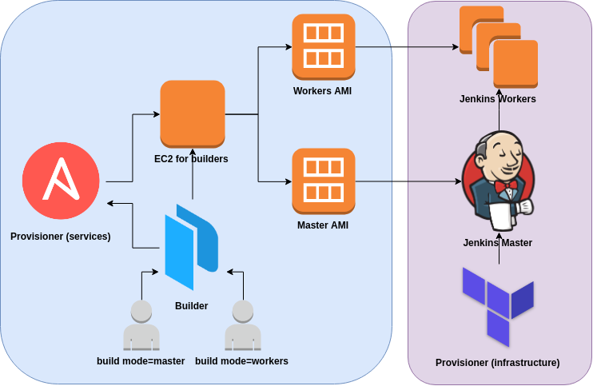

# Jenkins - Distributed Builds

## Quickstart

```bash
make install \
  AWS_REGION=ap-northeast-1 \
  AWS_AZ=ap-northeast-1c \
  VPC_ID=vpc-e4054783 \
  AWS_SUBNET=subnet-dc3d7887 \
  KEY_NAME=AWS-VPC-019 \
  MASTER_TYPE=t2.small \
  WORKERS_TYPE=r4.xlarge \
  SOURCE_AMI=ami-06cd52961ce9f0d85 \
  DESIRE_WORKERS=2
```

## Delete

```bash
make purge \
  AWS_REGION=ap-northeast-1 \
  AWS_AZ=ap-northeast-1c \
  VPC_ID=vpc-e4054783 \
  AWS_SUBNET=subnet-dc3d7887 \
  KEY_NAME=AWS-VPC-019 \
  MASTER_TYPE=t2.small \
  WORKERS_TYPE=r4.xlarge \
  SOURCE_AMI=ami-06cd52961ce9f0d85 \
  DESIRE_WORKERS=2
```