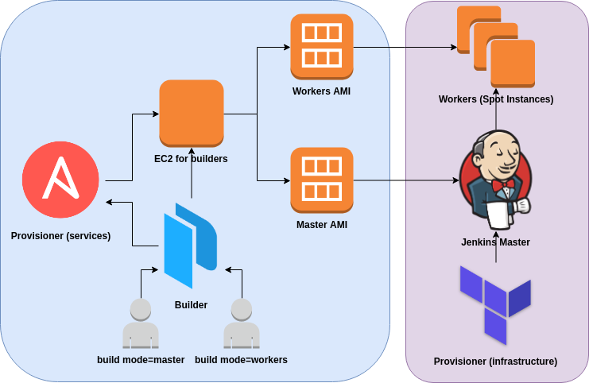

# Jenkins - Distributed Builds

It is pretty common when starting with Jenkins to have a single server which runs the master and all builds, however Jenkins architecture is fundamentally "Master+Agent". The master is designed to do co-ordination and provide the GUI and API endpoints, and the Agents are designed to perform the work. The reason being that workloads are often best "farmed out" to distributed servers. This may be for scale, or to provide different tools, or build on different target platforms. Another common reason for remote agents is to enact deployments into secured environments (without the master having direct access). 


## Documentation

Offical documentation is in the [docs](https://github.com/kubernetes/kops/blob/master/docs/README.md)


## Prerequisite

`packer` is required, see [here](https://www.packer.io/intro/getting-started/install.html).

`ansible` is required, see [here](https://docs.ansible.com/ansible/latest/installation_guide/intro_installation.html).

`terraform` is required, see [here](https://www.terraform.io/intro/getting-started/install.html).


## Quickstart

```bash
make install \
  AWS_REGION=ap-northeast-1 \
  AWS_AZ=ap-northeast-1c \
  VPC_ID=vpc-******** \
  AWS_SUBNET=subnet--******** \
  KEY_NAME=AWS-VPC-*** \
  MASTER_TYPE=t2.small \
  WORKERS_TYPE=r4.xlarge \
  SOURCE_AMI=ami-************ \
  DESIRE_WORKERS=2
```

## Delete

```bash
make clear \
  AWS_REGION=ap-northeast-1 \
  AWS_AZ=ap-northeast-1c \
  VPC_ID=vpc-******** \
  AWS_SUBNET=subnet--******** \
  KEY_NAME=AWS-VPC-*** \
  MASTER_TYPE=t2.small \
  WORKERS_TYPE=r4.xlarge \
  SOURCE_AMI=ami-************ \
  DESIRE_WORKERS=2
```